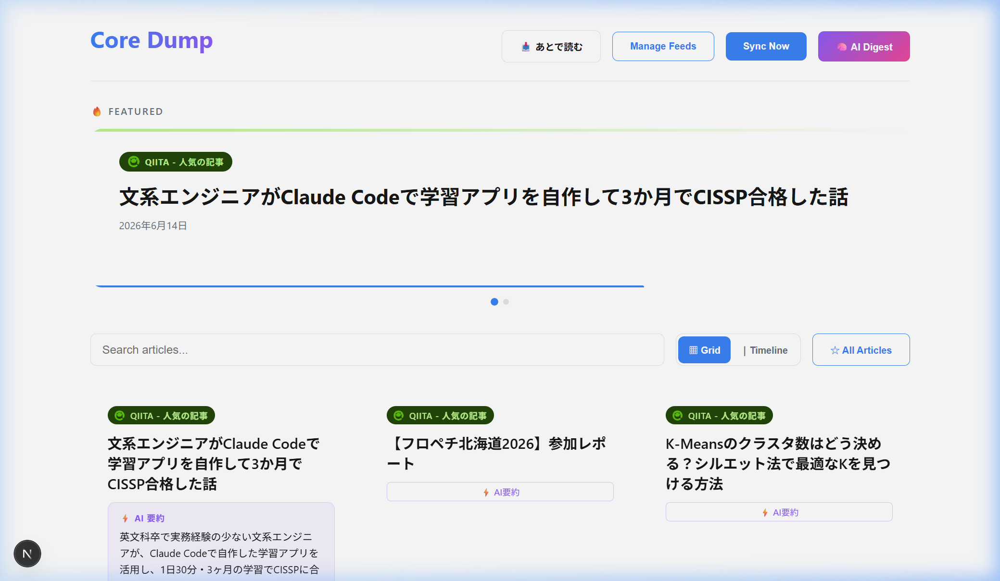
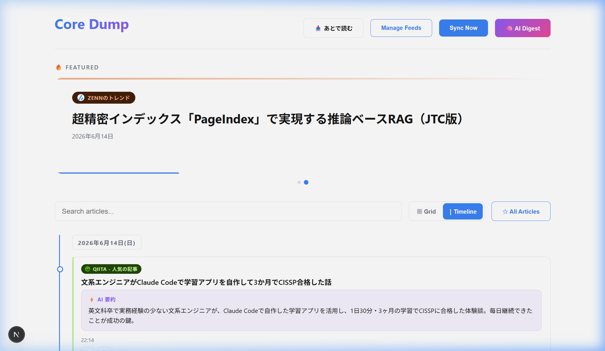

<p align="center">
  <h1 align="center">🔥 Core Dump</h1>
  <p align="center">
    <strong>ITエンジニアのための AI 搭載 RSS ニュースアグリゲーター</strong>
  </p>
  <p align="center">
    
    
    
    
    
    
  </p>
</p>

---

## 📖 概要

**Core Dump** は、複数の RSS フィードを一元管理し、Google Gemini AI による記事要約・デイリーダイジェスト生成でニュースの消化を効率化する、ITエンジニア向けのニュースリーダーです。

ダークモード対応のモダンなUIに、ヒーローカルーセル・グリッド/タイムラインの切り替え・リーダーモードなど、快適な閲覧体験を提供します。

### ✨ ハイライト

- 🤖 **Gemini AI** による個別記事のワンクリック要約
- 🧠 **AI Daily Digest** — 全記事のトレンド分析・要約レポートを自動生成
- 📥 **あとで読むキュー** — ドラッグ&ドロップで並び替え可能
- 📰 **2つのビューモード** — グリッド表示とタイムライン表示を自由に切り替え

---

## 📸 スクリーンショット

### グリッドビュー



### タイムラインビュー



---

## 🚀 主要機能

| 機能 | 説明 |
|------|------|
| 📡 **RSSフィード管理** | フィードの追加・削除・同期をUIから簡単操作 |
| 🔍 **記事検索** | タイトル・コンテンツでの全文検索 |
| ▦ **グリッドビュー** | 記事をカード形式でブラウジング |
| ⏐ **タイムラインビュー** | 日付ごとに記事を時系列で表示 |
| 🔥 **ヒーローカルーセル** | 各フィードの注目記事を自動スライドショー |
| 📖 **リーダーモード** | モーダルウィンドウで記事内容を快適に閲覧 |
| ⭐ **ブックマーク** | お気に入り記事を保存・フィルタリング |
| 📥 **あとで読むキュー** | ドラッグ&ドロップで並び替え可能なリーディングリスト |
| ⚡ **AI 記事要約** | Gemini AI による個別記事のワンクリック要約生成 |
| 🧠 **AI Daily Digest** | 全記事のトレンド分析・要約レポート（日次キャッシュ付き） |

---

## 🛠 技術スタック

| レイヤー | 技術 |
|---------|------|
| **フロントエンド** | [Next.js](https://nextjs.org/) 16 + [React](https://react.dev/) 19 + TypeScript 5 |
| **スタイリング** | [TailwindCSS](https://tailwindcss.com/) 4 + CSS Modules |
| **バックエンド** | Next.js App Router (API Routes) |
| **データベース** | [SQLite](https://sqlite.org/) ([Prisma](https://www.prisma.io/) ORM) |
| **AI エンジン** | [Google Gemini](https://ai.google.dev/) 2.5 Flash |
| **RSS 解析** | [rss-parser](https://github.com/rbren/rss-parser) |

---

## 📋 前提条件

- **Node.js** 20 以上
- **npm** (Node.js に同梱)
- **Google Gemini API キー** ([取得方法](https://ai.google.dev/))

---

## ⚡ セットアップ

### 1. リポジトリのクローン

```bash
git clone https://github.com/your-username/core-dump.git
cd core-dump/app_build
```

### 2. 依存関係のインストール

```bash
npm install
```

### 3. 環境変数の設定

`.env` ファイルをプロジェクトルート (`app_build/`) に作成してください。

```env
# データベース接続 (SQLite)
DATABASE_URL="file:./dev.db"

# Google Gemini API キー（AI機能に必要）
GEMINI_API_KEY="your-gemini-api-key-here"
```

> ⚠️ **注意**: `.env` ファイルには秘密情報が含まれるため、Git にはコミットしないでください。`.gitignore` に含まれていることを確認してください。

### 4. データベースのセットアップ

```bash
npx prisma generate
npx prisma db push
```

### 5. 開発サーバーの起動

```bash
npm run dev
```

ブラウザで [http://localhost:3000](http://localhost:3000) を開いてください。

---

## 📘 使い方

### フィードを追加する

1. ヘッダーの **「Manage Feeds」** ボタンをクリック
2. RSSフィードのURLを入力して **「Add Feed」** をクリック
3. **「Sync Now」** ボタンで記事を取得

### 記事を閲覧する

- **グリッドビュー (▦ Grid)**: カード形式で記事をブラウジング
- **タイムラインビュー (⏐ Timeline)**: 日付ごとに時系列で表示
- 記事タイトルをクリックで **リーダーモード** が開きます
- 🔍 検索バーでキーワード検索が可能

### AI 機能を使う

- **⚡ AI要約**: 各記事カードの「AI要約」ボタンで、Gemini が記事を要約
- **🧠 AI Digest**: ヘッダーの「AI Digest」ボタンで、全記事のトレンド分析レポートを生成
  - 同日中はキャッシュされ、「最新の記事で再生成」で強制更新も可能

### 記事を管理する

- **⭐ ブックマーク**: 記事の ☆ アイコンをクリックでお気に入りに追加
- **📥 あとで読む**: 📄 アイコンでキューに追加、ドラッグ&ドロップで並び替え

---

## 📁 プロジェクト構成

```
app_build/
├── prisma/
│   └── schema.prisma          # データモデル定義 (Feed, Article, Digest)
├── public/                    # 静的アセット
├── src/
│   ├── app/
│   │   ├── api/
│   │   │   ├── articles/      # 記事関連API
│   │   │   │   ├── [id]/
│   │   │   │   │   ├── bookmark/    # ブックマーク切り替え
│   │   │   │   │   ├── read-later/  # あとで読む切り替え
│   │   │   │   │   └── summarize/   # AI要約生成
│   │   │   │   ├── read-later/      # あとで読むキュー一覧・並び替え
│   │   │   │   └── route.ts         # 記事一覧取得
│   │   │   ├── digest/       # AI Daily Digest 生成
│   │   │   ├── feeds/        # フィード管理 (CRUD)
│   │   │   └── sync/         # フィード同期
│   │   ├── features.module.css    # 拡張機能のスタイル
│   │   ├── globals.css            # グローバルスタイル
│   │   ├── layout.tsx             # ルートレイアウト
│   │   ├── page.module.css        # メインページのスタイル
│   │   └── page.tsx               # メインページコンポーネント
│   └── lib/
│       ├── parser.ts          # RSS パーサー設定
│       ├── prisma.ts          # Prisma クライアント初期化
│       └── types.ts           # 共有型定義
├── docs/
│   └── images/                # ドキュメント用画像
├── .env                       # 環境変数（Git管理外）
├── package.json
├── tsconfig.json
└── next.config.ts
```

---

## 🔌 API リファレンス

### 記事 (Articles)

| メソッド | エンドポイント | 説明 |
|---------|--------------|------|
| `GET` | `/api/articles` | 記事一覧取得（`?q=` 検索、`?bookmarked=true` フィルタ対応） |
| `GET` | `/api/articles/read-later` | あとで読むキュー一覧取得 |
| `POST` | `/api/articles/[id]/bookmark` | ブックマーク切り替え |
| `POST` | `/api/articles/[id]/read-later` | あとで読むフラグ切り替え |
| `POST` | `/api/articles/[id]/summarize` | AI 記事要約生成 |
| `PUT` | `/api/articles/read-later/reorder` | あとで読むキューの並び替え |

### フィード (Feeds)

| メソッド | エンドポイント | 説明 |
|---------|--------------|------|
| `GET` | `/api/feeds` | 登録済みフィード一覧取得 |
| `POST` | `/api/feeds` | 新しいフィードを追加 |
| `DELETE` | `/api/feeds/[id]` | フィードを削除（関連記事も削除） |

### その他

| メソッド | エンドポイント | 説明 |
|---------|--------------|------|
| `POST` | `/api/sync` | 全フィードの記事を同期 |
| `POST` | `/api/digest` | AI Daily Digest を生成（`{ force: true }` で強制再生成） |

---

## 🗄 データモデル

```prisma
model Feed {
  id          String     @id @default(uuid())
  title       String
  url         String     @unique
  description String?
  lastFetched DateTime?
  articles    Article[]
}

model Article {
  id             String   @id @default(uuid())
  title          String
  link           String   @unique
  pubDate        DateTime
  content        String?
  creator        String?
  feed           Feed     @relation(...)
  isBookmarked   Boolean  @default(false)
  aiSummary      String?           // AI 要約キャッシュ
  isReadLater    Boolean  @default(false)
  readLaterOrder Int?              // キュー内の並び順
  isRead         Boolean  @default(false)
}

model Digest {
  id   String @id @default(uuid())
  date String @unique    // YYYY-MM-DD 形式
  html String            // 生成された HTML レポート
}
```

---

## 🤝 コントリビューション

コントリビューションを歓迎します！以下の手順に従ってください。

### 開発フロー

1. このリポジトリを **フォーク** する
2. フィーチャーブランチを作成する
   ```bash
   git checkout -b feature/amazing-feature
   ```
3. 変更をコミットする
   ```bash
   git commit -m '素晴らしい機能を追加'
   ```
4. ブランチにプッシュする
   ```bash
   git push origin feature/amazing-feature
   ```
5. **プルリクエスト** を作成する

### コーディング規約

- TypeScript の型は `src/lib/types.ts` に一元管理
- API ルートは Next.js App Router の規約に従う
- CSS は CSS Modules を使用
- コミットメッセージは日本語で記述

### バグ報告・機能リクエスト

Issue を作成してください。テンプレートに従って、以下の情報を含めてください：

- 再現手順（バグの場合）
- 期待する動作
- 実際の動作
- 環境情報（OS、Node.js バージョン等）

---

## 📄 ライセンス

このプロジェクトは [MIT License](LICENSE) のもとで公開されています。

---

<p align="center">
  <sub>Built with ❤️ for IT engineers</sub>
</p>
